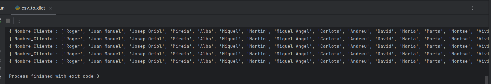
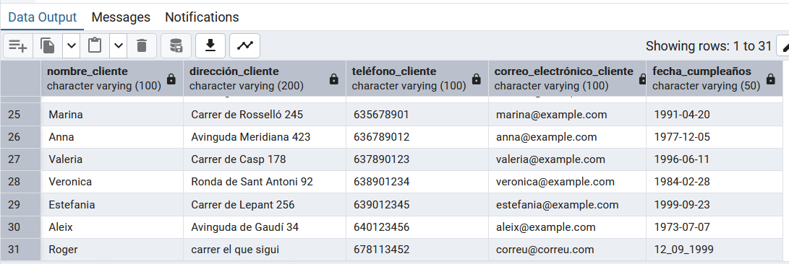
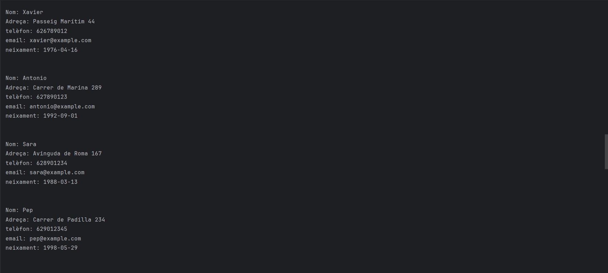
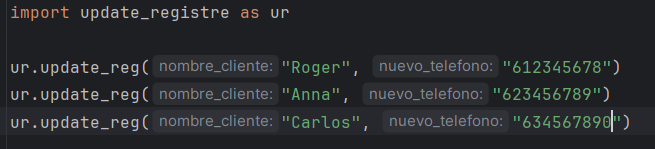
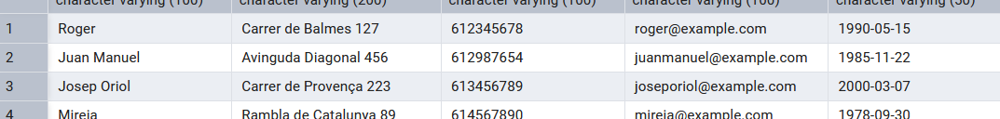
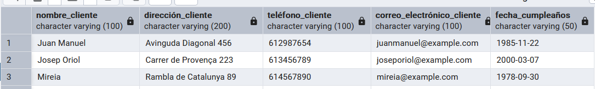

# SGE_BLOC2

### Passos seguits:

1. **Configuració de la connexió**: El codi de la connexió es troba a `connect.py`. Allà es defineixen els detalls de la base de dades (usuari, contrasenya, nom de la base de dades, etc.).
2. **Crida a la funció de connexió**: A `main.py`, es crida a la funció `connection_db()` que establirà la connexió.
3. **Comprovació de l'èxit**: Si la connexió és exitosa, es mostra el missatge "Connexió establerta amb èxit!". Si no, el sistema mostrarà un error per indicar el problema.

   **No hi ha missatge de desconexió degut al meu S.O (Windows).**

## Captura de la Inserció a la Base de Dades  

A continuació es mostra una captura de pantalla on es pot veure que les dades s'han inserit correctament a la BD mitjançant **pgAdmin 4**.

### Explicació de la Inserció  

1. Es van activar els serveis de `docker-compose.yml` per engegar PostgreSQL.  
2. Es va executar `create_table_to_db.py` per crear la taula `Clientes`.  
3. Es va transformar el fitxer `Clientes.csv` en un diccionari amb `csv_to_dict.py`.  
4. Es van inserir les dades a la BD amb `dict_to_db.py`.  
5. Finalment, es va comprovar la inserció a **pgAdmin 4**, tal com es veu a la captura de pantalla.  

## Captura de la Taula Clientes

La següent captura mostra que el registre s'ha inserit correctament a la base de dades:

### Explicació de la sortida
La captura mostra la sortida del fitxer `read_registre.py`, on s'han llegit els registres emmagatzemats a la base de dades.  

1. El resultat és una llista, on cada llista és amb els seus camps corresponents (Nom, Adreça, Teléfon, Email i neixament).  
2. S'ha extret la informació de cada camp mitjançant els índexs de la llista i s'ha imprès en un format llegible.  

### Modificació del registre en la base de dades

S'actualitzen les dades dels clients `Roger`, `Anna` i `Carlos`.

Carlos no existeix l'he utilitzat per veure que no hi ha cap error

### Eliminació de registres a la base de dades

Es van eliminar els clients `Roger`, `Ana` i `Carlos`.

Aquí Roger si hi és.

Eliminat amb exit!