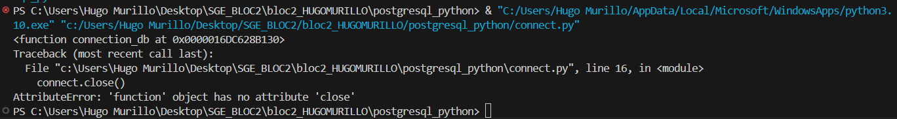

# SGE_BLOC2

### Passos seguits:

1. **Configuració de la connexió**: El codi de la connexió es troba a `connect.py`. Allà es defineixen els detalls de la base de dades (usuari, contrasenya, nom de la base de dades, etc.).
3. **Comprovació de l'èxit**: Si la connexió és exitosa, es mostra el missatge "Indicat a l'imatge". Si no, el sistema mostrarà un error per indicar el problema.
